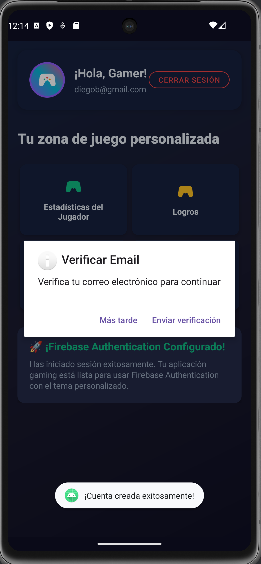
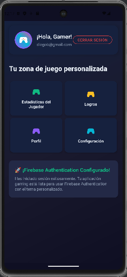
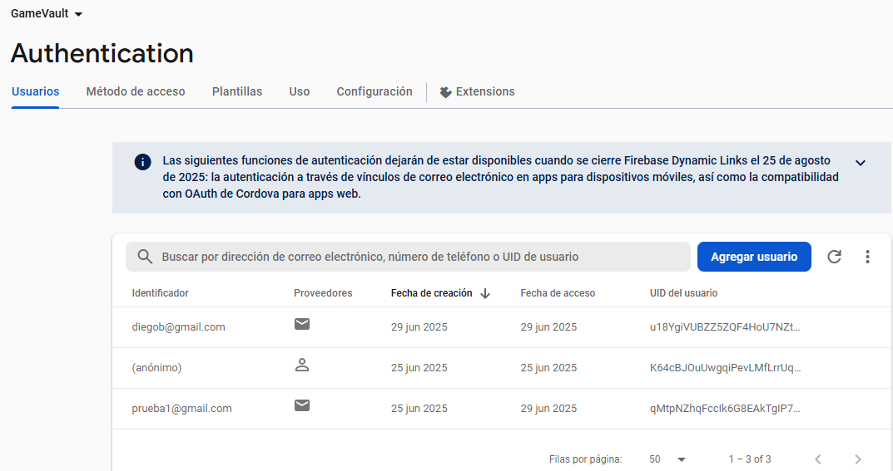

# 🎮 GameVault – App Android con Autenticación Firebase y Tema Gaming

`GameVault` es una aplicación móvil Android desarrollada en Kotlin como parte del curso de Aplicaciones Móviles. Este proyecto demuestra el uso de **Firebase Authentication** para el inicio de sesión con correo, contraseña o modo invitado, utilizando un diseño atractivo con temática gaming.

La aplicación ofrece autenticación segura, verificación de correo y recuperación de contraseña, todo integrado con un diseño moderno, modo oscuro y elementos visuales llamativos.

Este trabajo fue elaborado como parte de la Semana 10 del curso, con el objetivo de practicar autenticación móvil, Firebase y diseño visual avanzado en Android.

---

## 📸 Capturas de pantalla

| 🔐 **Login** | 👤 **Registro** |
|--------------------------|----------------------|
|  |  |

| ✉️ **Verificación** | 🎮 **Dashboard Temático** |
|-----------------------------------|----------------------------|
|  |  |

| ✉️ **Verificación en Firebase** |
|----------------------------|
|  |

---

## 📱 Características

- Login/Registro con correo electrónico y contraseña
- Modo invitado sin autenticación permanente
- Recuperación de contraseña y verificación de correo
- Logout seguro
- Validaciones de formularios
- Interfaz completamente en español
- Modo oscuro y tema visual gaming (gradientes, íconos personalizados)

---

## 🛠️ Tecnologías utilizadas

- Kotlin
- Android Studio
- Firebase Authentication
- SharedPreferences (para sesión)
- Material Design 3
- XML Layouts
- ConstraintLayout
- Gradle (KTS)
- MVVM (básico)

---

## 🔧 Estructura principal del proyecto

- `LoginActivity.kt`: Pantalla inicial de login y registro.
- `MainActivity.kt`: Dashboard con sesión iniciada.
- `google-services.json`: Archivo de configuración de Firebase.
- `colors.xml`, `strings.xml`: Configuración de tema e idioma.
- `activity_login.xml`, `activity_main.xml`: Layouts para login y dashboard.
- `drawable/`: Recursos gráficos personalizados (íconos, fondos).
- `build.gradle.kts`: Dependencias y configuración del proyecto.
